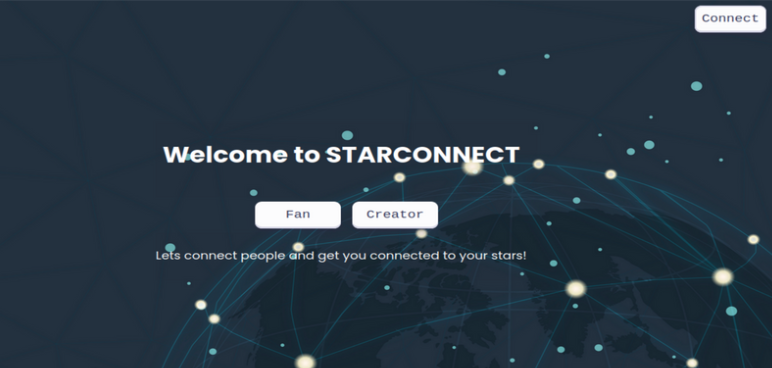
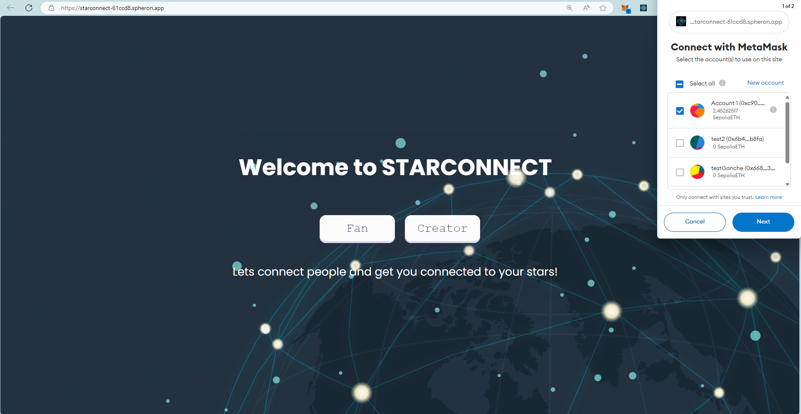
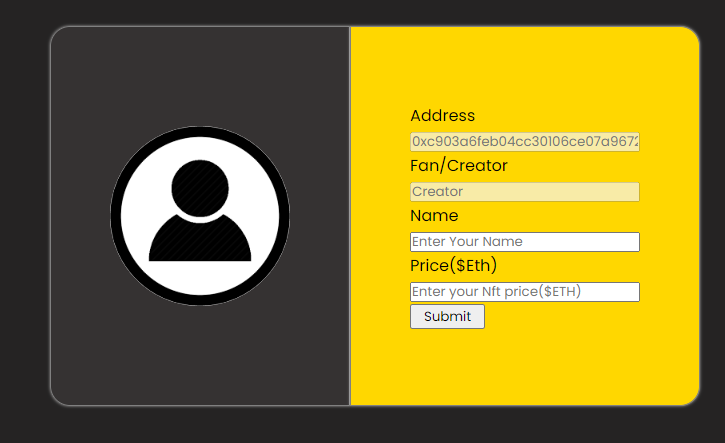
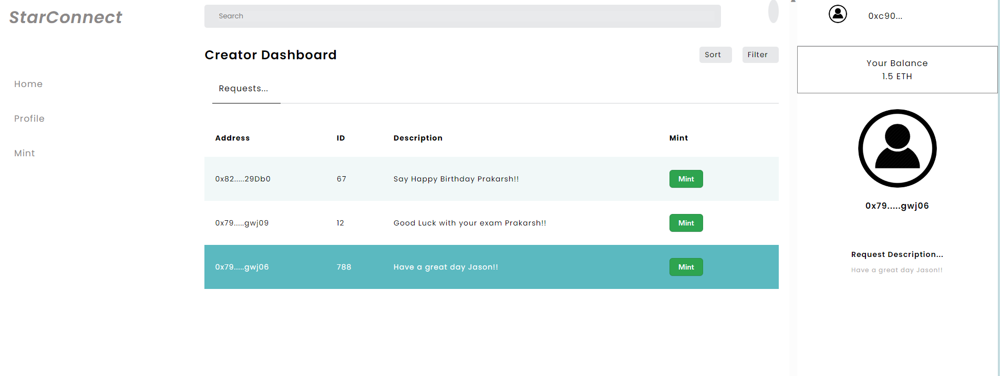
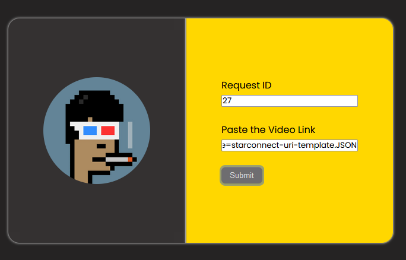
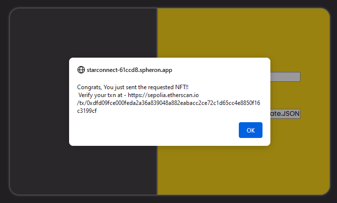
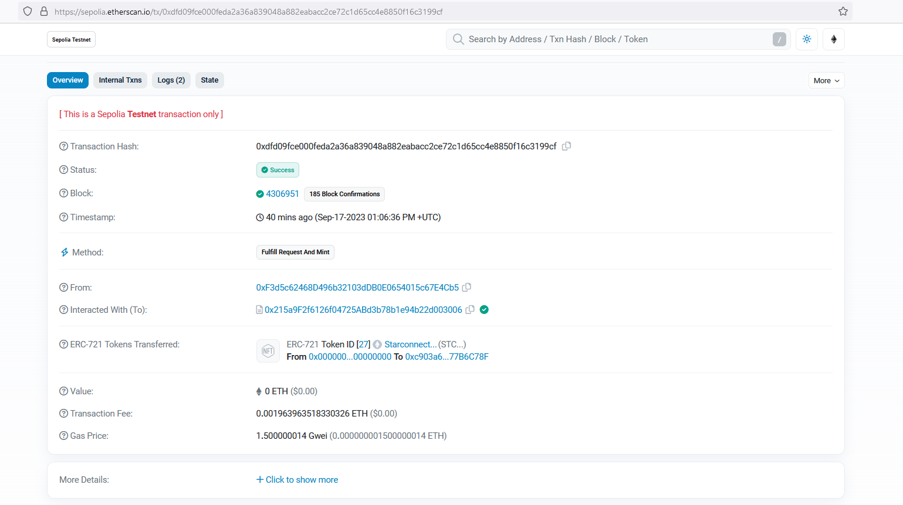
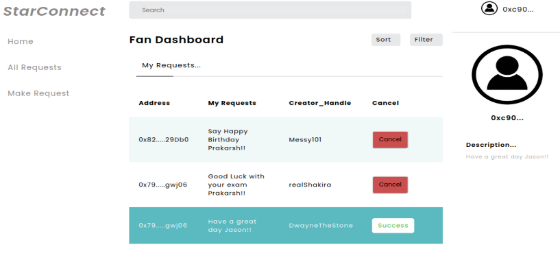
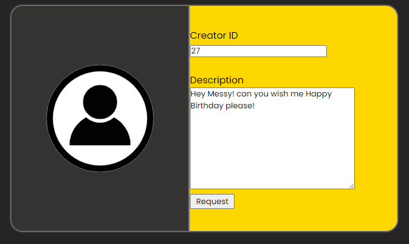
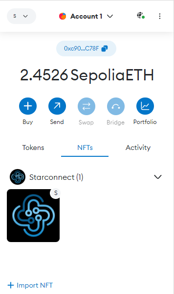

# StarConnect

# Revolutionizing personalized content creation and combating deep fake proliferation with NFTs
# Introduction
## StarConnect 
 a game-changing solution for combating the deep fake dilemma in the era of technology-driven illusions. By ingeniously melding blockchain and NFT innovation, StarConnect pioneers a transformative platform that bridges creators and fans via Non-Fungible Tokens (NFTs). This dynamic concept not only empowers content creators to monetize their talents but also fortifies the integrity of digital content.

Deep fake tech, with its capacity to craft convincingly counterfeit audio and video, jeopardizes trust and authenticity online. StarConnect proactively tackles this threat by enabling creators to verify their content through blockchain technology. This assures fans that they receive genuine, personalized videos directly from their cherished creators.

In a world where the line between reality and illusion blurs, StarConnect stands as a revolutionary safeguard, fostering trust, and bolstering creators' income streams. Join us in reshaping the digital landscape, where authenticity reigns supreme, with StarConnect.

## Technology used

StarConnect employs cutting-edge technologies to provide an immersive and secure experience for both creators and fans. Here's a closer look at the key components that make our platform a game-changer:

1.  **IPFS Network**: We leverage the power of the [IPFS Network](https://docs.ipfs.tech/concepts/what-is-ipfs/) to store custom video messages for fans. IPFS, or the InterPlanetary File System, is a decentralized and distributed file storage system. This ensures that your personalized content remains accessible and secure, free from the vulnerabilities of centralized servers.
    
2.  **React for Stunning UI**: Our user interface is crafted using [React](https://react.dev/learn), a powerful and popular JavaScript library. This choice allows us to create a visually appealing, interactive, and responsive interface that enhances the overall user experience.
    
3.  **Solidity Smart Contracts**: The backbone of StarConnect is built using [Solidity](https://docs.soliditylang.org/en/v0.8.21/), a language designed for Ethereum smart contracts. These contracts automate and secure various processes on our platform, such as content creation, authentication, and NFT management.
    
4.  **HardHat for Testing and Development**: We rely on [HardHat](https://hardhat.org/) for testing and development. It's a development environment and testing network for Ethereum, ensuring that our smart contracts are robust and error-free before they go live.
    
5.  **Node.js for Backend**: Our backend infrastructure is powered by [Node.js](https://nodejs.org/en), a versatile JavaScript runtime. Node.js enables efficient data processing, communication with the Ethereum blockchain, and seamless interactions between our frontend and smart contracts.
6. **Sepolia Testnet of Ethereum**: We've integrated the Sepolia testnet of Ethereum into our development and testing processes. This Ethereum test network allows us to simulate real Ethereum transactions and interactions without using actual cryptocurrency. It's an essential tool for ensuring the functionality and robustness of our smart contracts and the overall platform before it's deployed on the Ethereum mainnet

## Setup Guide
- Clone the project
- As this project is based on Node.js, your system need to have proper node setup, refer [this](https://nodejs.org/en/docs/)
- Navigate to the Client Folder as there is our Frontend lives!
-  Go the project through the terminal and install all dependencies by using typing `yarn install` in the terminal
- Add your deployed contract address in .env
-  Run the server using `yarn run dev`

## Screenshots

For visualization through a dashboard one may directly run the app locally and the get the UI provided through dist folder where all the minimized frontend lies.

## Creator's Guide

### HomePage

### Creator Wallet Login

### Setup as a Creator Profile

### Select Creator to go to Creator's Dashboard

### Mint Fan's Nft by video link and RequestID once a request is Received 

### Successful Mint of NFT !

### See the Minted Block on the blockchain After success 

## Fan's Pov

### HomePage

### Fan Wallet Login

### Select Fan to go to Fan's Dashboard

### Request the custom message 

### After the request is succesful view it on your Metamask!

# Our Team Details 

## Prakhar    [Github](https://github.com/j4web) | [twitter](https://twitter.com/0xj4web) | [Gmail](j4web.24@gmail.com)

## Pietro | [Github]([https://github.com/ScipioneParmigi]) | [twitter]([=https://twitter.com/pietro_zanotta]) | [Gmail](pietro.zanotta.02@gmail.com)

